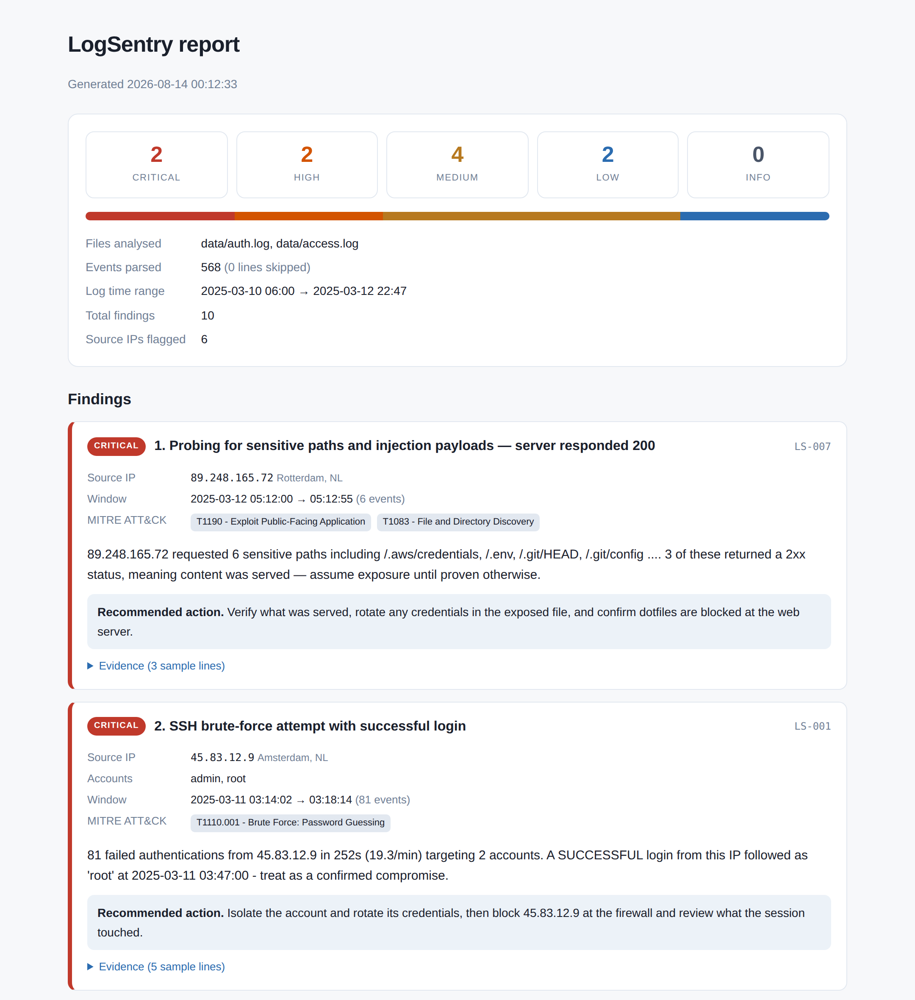

# LogSentry

**A blue-team log analysis engine.** Point it at authentication and web server logs; it parses them into a common event model, runs seven detection rules over the result, and produces an analyst-ready report with every finding mapped to a MITRE ATT&CK technique.

[](https://github.com/surayaazeez/logsentry/actions/workflows/ci.yml)


---

## Why this exists

Reading `auth.log` by hand does not scale. A server exposed to the internet collects thousands of failed SSH logins a day, and the handful of lines that matter — the burst that *succeeded*, the account that logged in from two continents 40 minutes apart — are buried in noise that looks identical.

LogSentry does the correlation a human would do if they had the patience: group by source, look at timing, compare against what happened next, and only surface the events where those signals line up.

It ships with **zero runtime dependencies**. Stock Python 3.10 on a locked-down box is enough.

---

## Quick start

```bash
git clone https://github.com/surayaazeez/logsentry.git
cd logsentry
pip install -e ".[dev]"

# Generate sample logs with known attacks planted in them
python scripts/generate_sample_logs.py --out data/

# Analyse them
logsentry scan data/auth.log data/access.log --year 2025
```

That produces:

```
==============================================================================
  LogSentry — log analysis report
==============================================================================
  Files analysed : data/auth.log, data/access.log
  Events parsed  : 568 (0 skipped)
  Log time range : 2025-03-10 06:00:57 → 2025-03-12 22:47:47
  Findings       : 10
  Severity       :  CRITICAL 2    HIGH 2    MEDIUM 4    LOW 2
==============================================================================

[ 2]  CRITICAL  SSH brute-force attempt with successful login  (LS-001)
     Source    : 45.83.12.9  [Amsterdam, NL]
     Accounts  : admin, root
     Window    : 2025-03-11 03:14:02 → 03:18:14  (81 events)
     ATT&CK    : T1110.001 - Brute Force: Password Guessing
     81 failed authentications from 45.83.12.9 in 252s (19.3/min)
     targeting 2 accounts. A SUCCESSFUL login from this IP
     followed as 'root' at 2025-03-11 03:47:00 - treat as a
     confirmed compromise.
     Evidence:
       > Mar 11 03:14:02 web-01 sshd[13085]: Failed password for root fr...
       > Mar 11 03:14:05 web-01 sshd[19814]: Invalid user admin from 45....
     Action    : Isolate the account and rotate its credentials, then block
     45.83.12.9 at the firewall and review what the session touched.

[ 3]  HIGH  Impossible travel between successful logins  (LS-003)
     Source    : 191.96.77.204  [Sao Paulo, BR]
     Accounts  : j.okoro
     Window    : 2025-03-12 14:00:00 → 14:40:00  (2 events)
     ATT&CK    : T1078 - Valid Accounts
     Account 'j.okoro' logged in from Doha, QA (212.83.44.18) and
     then Sao Paulo, BR (191.96.77.204) 40 minutes later — 11,871
     km apart, an implied travel speed of 17,807 km/h. A VPN or
     mobile carrier NAT can explain this; credential theft can too.
```

### HTML report

```bash
logsentry scan data/auth.log data/access.log --year 2025 --html report.html
```

A single self-contained file — no external CSS, JS or fonts, so it survives being emailed as an attachment. Light and dark themes both supported.



---

## Detection rules

| ID | Rule | What it keys on | ATT&CK |
|----|------|-----------------|--------|
| LS-001 | SSH brute force | ≥10 auth failures from one IP in 5 min; escalates to **critical** if a login from that IP then succeeds | [T1110.001](https://attack.mitre.org/techniques/T1110/001/) |
| LS-002 | Password spraying | ≥8 distinct accounts, ≤3 attempts each, from one IP in 30 min | [T1110.003](https://attack.mitre.org/techniques/T1110/003/) |
| LS-003 | Impossible travel | Two successful logins for one account implying travel above 900 km/h | [T1078](https://attack.mitre.org/techniques/T1078/) |
| LS-004 | Off-hours access | Successful external login outside configured business hours | [T1078](https://attack.mitre.org/techniques/T1078/) |
| LS-005 | Suspicious sudo | Privileged commands touching `/etc/shadow`, `auditd`, firewall rules, shell history | [T1548.003](https://attack.mitre.org/techniques/T1548/003/), [T1070](https://attack.mitre.org/techniques/T1070/) |
| LS-006 | Web vulnerability scanning | Known scanner user-agents (sqlmap, nikto, gobuster…) or a burst of 404s | [T1595.002](https://attack.mitre.org/techniques/T1595/002/) |
| LS-007 | Sensitive path probing | Requests for `/.env`, `/.git/`, traversal, SQLi payloads; **critical** if the server returned 2xx | [T1190](https://attack.mitre.org/techniques/T1190/), [T1083](https://attack.mitre.org/techniques/T1083/) |

`logsentry rules` lists these at runtime, with each rule's tunable thresholds.

### Two design decisions worth explaining

**Brute force and password spraying are separate rules on purpose.** They are mirror images: brute force is many passwords against few accounts, spraying is few passwords against many accounts. An attacker sprays precisely *because* it stays under the per-account lockout threshold a brute-force rule watches. Counting attempts alone would miss it; LS-002 keys on account breadth instead.

**Severity is contextual, not fixed per rule.** The same brute-force pattern is `MEDIUM` when every attempt failed and `CRITICAL` when one succeeded — because the response differs: one is "block an IP", the other is "you have an incident". Likewise LS-007 escalates only when a probe for `/.env` actually returned content.

---

## Supported log formats

Auto-detected by sniffing the first lines; override with `--format`.

| Format | `--format` | Source |
|--------|-----------|--------|
| OpenSSH / sudo in syslog | `sshd` | `/var/log/auth.log`, `/var/log/secure` |
| nginx / Apache combined | `nginx` | `access.log` |
| Windows Security events (CSV) | `winsec` | `Get-WinEvent \| Export-Csv` |

`.gz` files are read directly. Malformed lines are counted and skipped, never fatal.

---

## Usage

```bash
logsentry scan LOGFILE [LOGFILE...] [options]

  --format {nginx,sshd,winsec}   Force a parser instead of auto-detecting
  --year YEAR                    Year for syslog timestamps, which omit it
  --min-severity LEVEL           Suppress findings below this level
  --json PATH                    Write JSON ('-' for stdout)
  --html PATH                    Write a self-contained HTML report
  --fail-on LEVEL                Exit 1 only at/above this severity
  --quiet                        No terminal output

  --threshold N                  LS-001: failures per window
  --window-minutes N             LS-001: window size
  --min-users N                  LS-002: distinct accounts
  --business-hours START-END     LS-004: working day, e.g. 8-18
```

Examples:

```bash
# Only serious findings, as JSON, piped into jq
logsentry scan /var/log/auth.log --min-severity high --quiet --json - | jq '.findings[].title'

# Tighter brute-force threshold and a 9-to-5 working day
logsentry scan /var/log/auth.log --threshold 5 --business-hours 9-17

# Gate a CI pipeline: fail the build only on critical findings
logsentry scan /var/log/auth.log --quiet --fail-on critical
```

**Exit codes:** `0` clean · `1` findings reported · `2` error. This is what makes it usable as a cron job or CI step rather than only interactively.

### As a library

```python
from logsentry import Engine, Severity, render_html

result = Engine(min_severity=Severity.HIGH).analyze_files(["/var/log/auth.log"])

for finding in result.findings:
    print(finding.severity, finding.title, finding.src_ip)

print(result.severity_counts)          # {'critical': 2, 'high': 1, ...}
open("report.html", "w").write(render_html(result))
```

---

## Architecture

```
   log files                                            reports
      │                                                    ▲
      ▼                                                    │
┌───────────┐     ┌──────────┐     ┌────────────┐    ┌───────────┐
│  Parsers  │ ──▶ │ LogEvent │ ──▶ │   Rules    │ ─▶ │  Finding  │
│           │     │(normalised)    │            │    │           │
│ sshd      │     └──────────┘     │ LS-001…007 │    │ terminal  │
│ nginx     │           ▲          └────────────┘    │ JSON      │
│ winsec    │           │                  ▲         │ HTML      │
└───────────┘     ┌───────────┐            │         └───────────┘
                  │  enrich   │────────────┘
                  │ (geo/ASN) │
                  └───────────┘
```

Everything crosses two boundaries and no others: parsers emit `LogEvent`, rules emit `Finding`. A parser never knows a rule exists, and a rule never sees a raw log format. Adding SSH support to a rule written for Windows events took no code changes — that is the whole point of normalising first.

```
src/logsentry/
├── models.py         LogEvent, Finding, Severity — the shared contract
├── parsers/          one module per log format, self-registering
├── detections/       one module per rule family, self-registering
├── enrich.py         offline IP → geo/ASN, haversine distance
├── engine.py         orchestration: parse → run rules → sort → collect
├── report.py         terminal / JSON / HTML renderers
└── cli.py            argparse front end
```

**Adding a rule** is one file and one import:

```python
from logsentry.detections.base import Rule, register_rule
from logsentry.models import Finding, Severity

@register_rule
class MyRule(Rule):
    rule_id = "LS-008"
    title = "Something worth alerting on"
    mitre = ["T1234 - Technique Name"]
    defaults = {"threshold": 5}          # exposed as a CLI/config tunable

    def run(self, events):
        ...
        return findings
```

It is then picked up automatically by the engine, the CLI, and `logsentry rules`.

---

## Testing

```bash
pytest                                    # 77 tests
pytest --cov=logsentry --cov-report=term-missing   # 94% coverage
ruff check src tests scripts
```

CI runs the suite against Python 3.10, 3.11 and 3.12 on every push, then smoke-tests the CLI end to end and uploads the generated HTML report as a build artifact.

Every rule is tested three ways: it fires when it should, it stays quiet on benign data, and it escalates correctly. The **true negatives carry the most weight** — a rule that alerts on everything is worse than no rule, so the suite asserts that three password typos are not a brute-force attack, that a London→Singapore login 14 hours apart is a normal flight, and that ordinary `apt-get update` via sudo is not privilege abuse.

There is also a test asserting that a crafted log line containing `<script>` cannot inject markup into the HTML report — log files are attacker-controlled input, and a report that renders them unescaped is a vulnerability in the security tool itself.

---

## Sample data

`scripts/generate_sample_logs.py` builds realistic `auth.log` and `access.log` files from a fixed seed, with seven attack scenarios planted in benign background traffic — a brute force that succeeds, a spray across 12 accounts, an impossible-travel pair, post-compromise anti-forensics, sqlmap scanning, and a `.env` leak that returns HTTP 200.

The generator's docstring lists which rule each scenario is meant to trigger, and a test asserts all seven fire. Shipping generated data rather than real logs means the repo is safe to make public and the demo is reproducible.

---

## Limitations

Worth being direct about, since a detection tool that overstates its confidence is dangerous:

- **Geolocation is a bundled offline table**, not a live database. It covers the ranges in the sample data and common hosting providers. For production, swap `enrich.lookup()` for MaxMind GeoLite2 — the rest of the code depends only on the return type.
- **Impossible travel produces false positives** on VPNs, mobile carrier NAT, and cloud-hosted CI runners. The finding text says so rather than asserting compromise.
- **No IPv6 geolocation** yet; IPv6 events parse and are analysed by every rule except LS-003.
- **Findings are indicators, not verdicts.** The tool ranks and explains; a human decides.

---

## Roadmap

- [ ] MaxMind GeoLite2 support as an optional extra
- [ ] Threat-intel feed lookups (AbuseIPDB, Spamhaus) with local caching
- [ ] YAML rule configuration so thresholds live outside the code
- [ ] Sigma rule import
- [ ] `--follow` mode for near-real-time tailing

---

## License

MIT — see [LICENSE](LICENSE).
